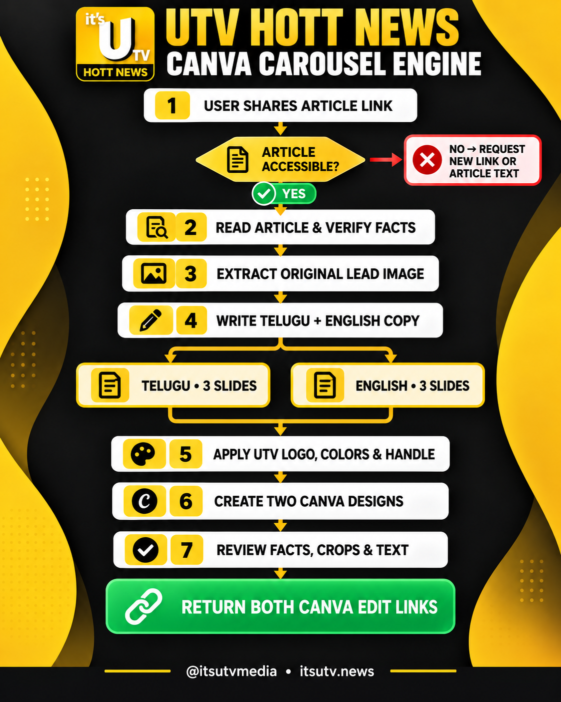

# UTV Hott News bilingual Canva carousel skill



Give a UTV Hott News article link to an agent with this skill installed. It reads the article, drafts Telugu and English copy, uses the article's lead image, builds matching four-page Canva imports, checks the requested language designs, and returns Canva edit links. Page four invites readers to download UTV Hott News App for more news on the article's topic.

Each page uses the small UTV Hott News logo at top left and a white Instagram icon with `@utvhottnewsapp` at bottom right. The original yellow, black, red, and white palette and fonts are preserved.

Shapes and their labels are separate editable layers. Text is centered above each shape, including fact cards, number circles, badges, the app download panel, and the footer.

See [SKILL.md](SKILL.md) for the workflow and [platform instructions](references/platforms.md) for ChatGPT, Claude, Codex, Google Antigravity, Windows, and Mac.

The local generator needs Python 3.11+ and the article's downloaded lead photo. Example:

```sh
python3 scripts/build_carousel.py --story examples/story.example.json --image article.jpeg --output out-first-story
```

On Windows, replace `python3` with `py -3`. The ZIP outputs are imported into Canva as separate four-page designs. A Canva connection is required to return edit links automatically.
